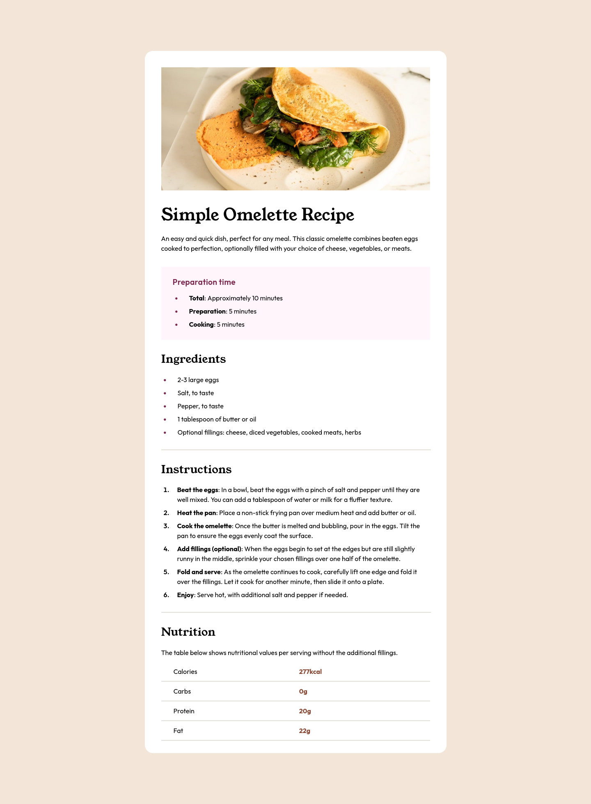

# Frontend Mentor - Recipe page solution

This is a solution to the [Recipe page challenge on Frontend Mentor](https://www.frontendmentor.io/challenges/recipe-page-KiTsR8QQKm). Frontend Mentor challenges help you improve your coding skills by building realistic projects.

## Table of contents

- [Overview](#overview)
  - [The challenge](#the-challenge)
  - [Screenshot](#screenshot)
  - [Links](#links)
- [My process](#my-process)
  - [Built with](#built-with)
  - [What I learned](#what-i-learned)
  - [Continued development](#continued-development)
  - [Useful resources](#useful-resources)
  - [AI Collaboration](#ai-collaboration)
- [Author](#author)
- [Acknowledgments](#acknowledgments)

## Overview

### Screenshot



### Links

- Solution URL: [GitHub repository](https://github.com/kimatsar/recipe-page)
- Live Site URL: [GitHub Pages](https://kimatsar.github.io/recipe-page)

## My process

### Built with

- Semantic HTML5 markup
- CSS custom properties
- Flexbox
- CSS reset
- Media Queries
- Pseudo-element

### What I learned

I learned how to use media queries, how to style markers, how to properly create table, and more responsive stuff.

```css
@media only screen and (max-width: 735px) { ... }

```

### Continued development

I should learn more about CSS overall. Also, I'm 100% sure there's a lot of room for improvement for this solution, I could spend more time and effort for this project.

### Useful resources

- [W3Schools](https://www.w3schools.com) - Good CSS reference.
- [MDN Web Docs](https://www.developer.mozilla.org) - Another really good CSS reference.

### AI Collaboration

I used Gemini to ask questions about CSS problems, but I did not ask the AI to build the page entirely for me.

## Author

- Website - [GitHub](https://www.github.com/kimatsar)
- Frontend Mentor - [@Kimatsar](https://www.frontendmentor.io/profile/kimatsar)
- Twitter - [@kimatsar](https://www.x.com/kimatsar)

## Acknowledgments

Thanks everyone.
